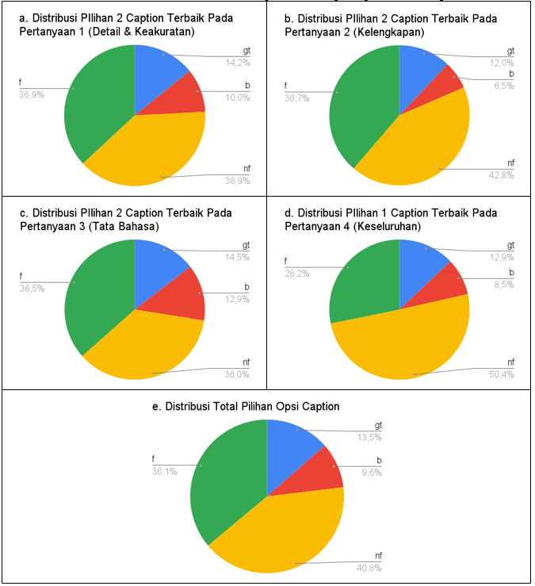
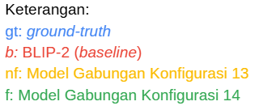
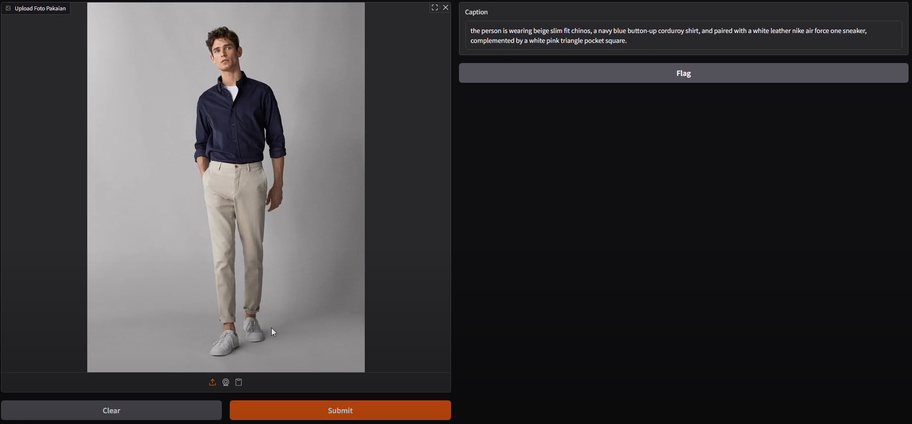
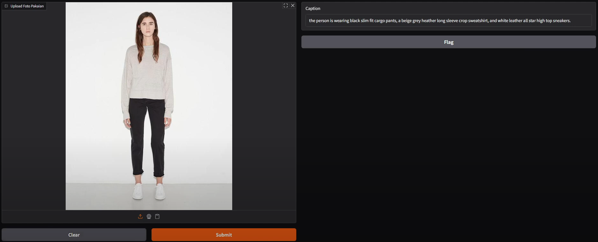

# 🏁 Tugas Akhir (TA) - Undergraduate Thesis

|     |  |
| -------- | ------- |
| **Nama Mahasiswa**  | Duevano Fairuz Pandya    |
| **NRP** | 5025211052     |
| **Judul TA**    | Pembangkitan Deskripsi Gambar _Fashion_ Berbahasa Inggris dengan Metode _Bootstrapping Language-Image Pre-training_    |
| **Dosen Pembimbing**    | Shintami Chusnul Hidayati, S.Kom., M.Sc., Ph.D.    |

---

## 📺 Demo Aplikasi  
Embed video demo di bawah ini:  

  
*Klik gambar di atas untuk menonton demo*

---

## 🛠 Panduan Penggunaan

### Prasyarat  
**Core dependencies**
- torch>=2.6.0
- transformers==4.50.3
- accelerate>=1.52.0
- datasets>=2.14.4
- peft>=0.14.0
- evaluate>=0.4.5
- rouge_score>=0.1.2
- openai>=1.70.0
- gradio>=5.31.0

**Detectron2**
- git+https://github.com/facebookresearch/detectron2.git

**CUDA/cuDNN compatibility (Google Colab)**
- CUDA Version: 12.5
- cuDNN Version: 9.2.1

**TensorFlow (optional, if needed)**
- tensorflow==2.18.0

**Runtime environment**
- python>=3.10

---
### Cara Menjalankan
**Seluruh resources Tugas Akhir ini dapat diakses pada [Google Drive ini](https://drive.google.com/drive/folders/1wS4IOzDqAYXSNO2VHnoOLL41g2vcAJvB?usp=sharing)**

**Untuk menjalankan inference model di lokal**, buat sebuah environment python baru (bisa menggunakan python venv atau conda) dengan `CUDA>=11.8` dan `CUDNN>=9.1` **jika menggunakan GPU**,  lalu instal seluruh dependensi di `requirements.txt`, kemudian jalankan notebook berikut ini sesuai dengan kebutuhan: 
- [blip2coba.ipynb](https://youtube.com) merupakan notebook lokal yang digunakan untuk menjalankan inference model pembangkit deskripsi gambar (BLIP-2) saja
- [detectron2coba.ipynb](https://youtube.com) merupakan notebook lokal yang digunakan untuk menjalankan inference model segmentasi (Mask R-CNN) 
- [integrating.ipynb](https://youtube.com) merupakan notebook lokal yang digunakan untuk menjalankan inference model gabungan (segmentasi-captioning-LLM) dan deploy gradio di lokal
- [integrating-per-image.ipynb](https://youtube.com) merupakan notebook lokal yang digunakan untuk menjalankan inference model gabungan (segmentasi-captioning-LLM) untuk memantau kinerja waktu yang dibutuhkan 

Sangat disarankan untuk menjalankan projek ini di Google Colab, berikut ini adalah beberapa Notebook Google Colab yang dapat digunakan secara langsung: 
|  📙Notebook   | 🧾Deskripsi  |
| -------- | ------- |
| [Detectron2_maskrcnn_coba.ipynb](https://colab.research.google.com/drive/1GQoPYtM-0r0Y6gBKzBUOruxaz9OOzqIQ?usp=sharing)  | Notebook yang digunakan untuk melatih, inference, dan mengevaluasi model segmentasi objek individu (Mask R-CNN Detectron2)    |
| [Copy of 4_blip2_visual_to_text_USER.ipynb](https://colab.research.google.com/drive/10WGnHjLroDEvbytE5F5BzAwHIq6Y2vEt?usp=sharing)  | Notebook yang digunakan untuk melatih, inference, dan mengevaluasi model pembangkit deskripsi gambar (BLIP-2)    |
| [Demo_BLIP-2_KP Fashion Caption.ipynb](https://colab.research.google.com/drive/1nLuoGidAaTCMDysGaevncZTULXRLFrhS?usp=sharing)  | Notebook yang digunakan untuk inference gambar unggahan ke model pembangkit deskripsi gambar (BLIP-2)    |
| [Detectron2-BLIP2-integrating.ipynb](https://colab.research.google.com/drive/18GINIcIU7IrKrBBspA3nr-oM5CktYphh?usp=sharing)  | Notebook yang digunakan untuk inference & evaluasi Model Akhir (Model Gabungan segmentasi-captioning)    |
| [integrating-cobagradio.ipynb](https://colab.research.google.com/drive/18Qz_n2C-ncds7Q2mDa2nr1FLazkrYXP6?usp=sharing)  | Notebook yang digunakan untuk deploy (di runtime) Model Akhir ke gradio    |

Untuk notebook lain yang ada pada Google Drive di atas merupakan notebook utilitas yang digunakan untuk eksplorasi, pembersihan data, dan uji coba lainnya

---
## 📊 Hasil
### I. Mask R-CNN Detectron2
Hasil Metrik Kuantitatif 5 Model Segmentasi Objek Individu (Mask R-CNN Detectron2) Terhadap **Test-set**:

| Eksperimen | AP (bbox) | AP50 (bbox) | AP75 (bbox) | AP (segm) | AP50 (segm) | AP75 (segm) |
|------------|-----------|------------------------|------------------------|-----------|------------------------|------------------------|
| 1          | 40,01     | 60,99                  | 45,49                  | 38,63     | 62,23                  | 41,51                  |
| 2          | 49,44     | 72,03                  | **56,72**              | 46,90     | 73,45                  | **52,39**              |
| 3          | 43,60     | 67,16                  | 49,61                  | 42,15     | 67,88                  | 45,85                  |
| 4          | 43,75     | 66,90                  | 49,66                  | 41,87     | 66,54                  | 45,79                  |
| 5          | **50,36** | **72,33**              | 56,58                  | **47,25** | **73,54**              | 51,35                  |

### II. BLIP-2
Ringkasan Metrik Evaluasi Pelatihan Model BLIP2 Fase Kedua terhadap **Val-set**:

| Model | Metode         | ROUGE-1 | ROUGE-2 | ROUGE-L | BLEU@1 | BLEU@2 |
|-------|----------------|---------|---------|---------|--------|--------|
| 1     | Dengan Padding | 0,41    | 0,13    | 0,40    | 0,36   | 0,21   |
|       | Tanpa Padding  | **0,42**    | **0,17**    | **0,41**    | **0,40**   | **0,26**   |
| 7     | Dengan Padding | 0,39    | 0,12    | 0,37    | 0,34   | 0,19   |
|       | Tanpa Padding  | 0,40    | 0,11    | 0,39    | 0,36   | 0,20   |
| 10    | Dengan Padding | 0,39    | 0,11    | 0,38    | 0,35   | 0,20   |
|       | Tanpa Padding  | 0,40    | 0,12    | 0,39    | 0,33   | 0,19   |

Ringkasan Metrik Evaluasi Pelatihan Model BLIP2 Fase Kedua terhadap **Test-set**:

| Model | Metode         | ROUGE-1 | ROUGE-2 | ROUGE-L | BLEU@1 | BLEU@2 |
|-------|----------------|---------|---------|---------|--------|--------|
| 1     | Dengan Padding | 0,42    | 0,13    | 0,42    | 0,39   | 0,22   |
|       | Tanpa Padding  | 0,41    | 0,12    | 0,41    | 0,39   | 0,22   |
| 7     | Dengan Padding | 0,42    | 0,13    | 0,42    | 0,38   | 0,21   |
|       | Tanpa Padding  | 0,42    | 0,12    | 0,41    | 0,39   | 0,22   |
| 10    | Dengan Padding | 0,41    | 0,12    | 0,41    | 0,38   | 0,21   |
|       | Tanpa Padding  | 0,41    | 0,12    | 0,41    | 0,36   | 0,20   |

### III. Model Akhir / Model Gabungan (Segmentasi-Captioning)
Skor Metrik Evaluasi Kuantitatif Semua Model Gabungan
| konfig no. | rouge1 | rouge2 | rougel | bleu@1 | bleu@2 | cider | spice |
|------------|--------|--------|--------|--------|--------|--------|--------|
| 1          | 0,22   | 0,03   | 0,20   | 0,16   | 0,03   | 0,43   | 0,09   |
| 2          | 0,19   | 0,03   | 0,16   | 0,14   | 0,03   | 0,14   | 0,06   |
| 3          | 0,19   | 0,03   | 0,16   | 0,14   | 0,03   | 0,14   | 0,06   |
| 4          | 0,16   | 0,02   | 0,14   | 0,11   | 0,02   | 0,05   | 0,05   |
| 5          | 0,16   | 0,02   | 0,13   | 0,11   | 0,02   | 0,05   | 0,05   |
| 6          | 0,16   | 0,02   | 0,14   | 0,12   | 0,02   | 0,21   | 0,06   |
| 7          | 0,22   | 0,03   | 0,20   | 0,17   | 0,03   | 0,44   | 0,09   |
| 8          | 0,22   | 0,03   | 0,18   | 0,17   | 0,03   | 0,43   | 0,08   |
| 9          | 0,18   | 0,02   | 0,15   | 0,13   | 0,03   | 0,21   | 0,07   |
| 10         | 0,22   | 0,03   | 0,20   | 0,17   | 0,03   | 0,43   | 0,09   |
| 11         | 0,18   | 0,02   | 0,15   | 0,13   | 0,03   | 0,22   | 0,07   |
| 12         | 0,21   | 0,03   | 0,18   | 0,15   | 0,03   | 0,21   | 0,07   |
| 13         | 0,18   | 0,03   | 0,15   | 0,13   | 0,03   | 0,20   | 0,07   |
| 14         | 0,21   | 0,03   | 0,18   | 0,15   | 0,03   | 0,20   | 0,07   |
| 15         | 0,20   | 0,03   | 0,17   | 0,16   | 0,03   | 0,19   | 0,07   |
| 16         | 0,23   | 0,03   | 0,19   | 0,18   | 0,04   | 0,24   | 0,08   |

 

Hasil Evaluasi Kualitatif Subjektif Kuesioner (50 Partisipan terhadap 50 Gambar Berbeda):
| **Aspek Pertanyaan**       | **Uraian Pertanyaan**                                                                                                                                               |
|----------------------------|---------------------------------------------------------------------------------------------------------------------------------------------------------------------|
| Detail & Keakuratan        | Seberapa akurat dan detail *caption* ini dalam mendeskripsikan setiap komponen pakaian (jenis, fitur, warna, motif)? ~ Pilih dua *caption*                        |
| Kelengkapan                | Seberapa lengkap *caption* ini dalam mencakup semua komponen *fashion* utama (atasan, bawahan, alas kaki/aksesori) yang ada di *gambar*? ~ Pilih dua *caption*     |
| Tata Bahasa                | Seberapa natural dan benar tata bahasa (Bahasa Inggris) *caption* ini? ~ Pilih dua *caption*                                                                        |
| Keseluruhan Terbaik        | Secara keseluruhan, *caption* manakah yang paling baik menggambarkan gambar ini? ~ Pilih satu *caption*                                                           |

### IV. Contoh Inference Model Gabungan

---

## 📚 Dokumentasi Tambahan

- [Detectron2](https://github.com/facebookresearch/detectron2)
- [BLIP-2](https://huggingface.co/docs/transformers/model_doc/blip-2)
- [OpenAI](https://platform.openai.com/)

---

## ⁉️ Pertanyaan?

Hubungi:
- Penulis: duevanofairuz@gmail.com
- Pembimbing Utama: shintami@its.ac.id
